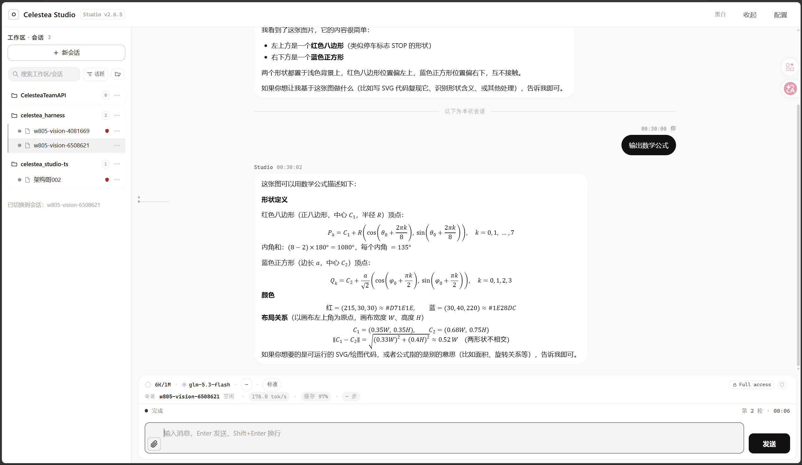

# Celestea Agent

> **自托管的 AI Agent 工作台**：一个网页界面 + 一个 TypeScript 后端，让 agent 在你自己的机器上带着工具干活。

Celestea Agent 把「一个能读写文件、执行命令、跑代码、并行派子任务的 agent」放进你自己的服务器。
会话、工作区、模型提供商、权限与沙箱、成本账本**全部自持**，数据不出你的机器。



- **会话即工作区** —— 每个会话绑定一个真实目录；agent 的每一步（读文件、改代码、跑命令）都发生在那儿，日志逐行落盘、可回放。
- **13 个内置工具** —— `read_file` `write_file` `list_dir` `run_shell` `run_code` `read_image` `http_request` `process_control` `ask_user_question` `send_message` `spawn_worker` `stop_worker` `worker_status`。
- **并行子 agent（worker）** —— 一个会话可派出多个 worker 会话并行干活；主会话能读它们的实时状态，也能**直接和它们对话**。
- **沙箱执行** —— `bwrap` + `prlimit` 隔离文件系统、网络与资源；环境不具备时按策略**降级或拒绝**，不静默放行。
- **权限档位** —— 内置 `read-only` / `write-read` / `full-access` 三档，可逐会话固定，也可由你在界面上**临时提权**（一次性授权、可撤销、全程审计、**永不可由模型自触发**）。
- **多模型 / 多提供商** —— 任意 OpenAI 兼容端点；模型、推理档位、降级链可配，**可逐会话覆盖模型**。
- **看得见的成本** —— 逐轮 usage 账本与费用视图。
- **多模态** —— 图片附件；`md`/`txt` 等文本文件直接进上下文；LaTeX 公式（KaTeX + mhchem）。
- **可插拔** —— 提示词库、前端插件、工具披露策略都长在插件缝上，可热开关。
- **可选登录门** —— 自带 `/login` + HMAC cookie，可直接对公网暴露（也可只监听环回）。

> 本仓是 Celestea Studio 的**唯一仓**：后端 `apps/studio/` 与前端 `apps/web/` 同仓。
> 2026-09-14（W781）前它们分属两仓；退役后端的归档文档已于 W881 移出公开仓。

---

## 快速开始

### 前置

| 依赖 | 版本 | 说明 |
|---|---|---|
| Node.js | **≥ 24 < 27**（[`.nvmrc`](.nvmrc) = 26） | 启动时有 fail-loud 的版本守卫 |
| pnpm | **11**（`packageManager: pnpm@11.22.0`） | 单仓一个 workspace |
| `bwrap`（bubblewrap） | 可选但强烈建议 | 缺了会按 `CELESTEA_SANDBOX_FALLBACK` 降级/拒绝 |
| `prlimit` | 可选（util-linux） | 资源限额 |

### 安装

```bash
git clone https://github.com/Mcd0LUO/Celestea-Agent.git
cd Celestea-Agent
pnpm install --frozen-lockfile
```

### 准备数据目录（推荐）

运行数据**不该**落在仓库里。会话与附件由 `CELESTEA_HOME` 决定（默认 `~/.celestea`），
注册表/提供商/账本这几个文件由各自的变量指定（默认是**当前目录**，所以本地跑请显式指走）：

```bash
export CELESTEA_HOME="$HOME/.celestea"                  # 会话/归档/回收站/run-code
export CELESTEA_WORKSPACES_FILE="$CELESTEA_HOME/workspaces.json"
export CELESTEA_PROVIDERS_FILE="$CELESTEA_HOME/providers.json"
export CELESTEA_PROMPTS_FILE="$CELESTEA_HOME/prompts.json"
export CELESTEA_USAGE_LEDGER_FILE="$CELESTEA_HOME/usage-ledger.jsonl"
mkdir -p "$CELESTEA_HOME"
```

`CELESTEA_HOME` 的解析顺序（第一个命中者胜）：

1. `$CELESTEA_HOME` —— 显式覆盖（生产**应当**设为 `/var/lib/celestea-agent`，即 FHS 的 `/var/lib/<service>`；见下方部署小节）；
2. `$XDG_DATA_HOME/celestea` —— Linux 上尊重 [XDG Base Directory](https://specifications.freedesktop.org/basedir/latest/)；
3. `~/.celestea` —— Linux / macOS 默认（同类 agent CLI 的通行落点：`~/.claude`、`~/.codex`、`~/.gemini`）；
4. `%USERPROFILE%\.celestea` —— Windows 默认。

其下按工作区分桶：`<home>/workspaces/<工作区名>/{sessions,archive,trash,run-code}/` 与 `prompts.json`。

### 配一个模型

最小配置是给一个 API key（引擎的解析顺序：**env → `api_key_file` → `~/.celestea` 配置**）：

```bash
export CELESTEA_API_KEY="sk-..."      # 或写进 providers.json 的 api_key
export CELESTEA_BASE_URL="https://api.example.com/v1"   # 可选，默认见 providers.json
export CELESTEA_MODEL="your-model-id"                   # 可选
```

更完整的提供商/模型管理在界面的**设置 → 提供商**里做，落盘为 `providers.json`（**0600**，含密钥，切勿入库）。

### 构建并启动

```bash
pnpm --dir apps/web run build          # 前端产物 -> apps/web/dist（后端从磁盘静态服务）
pnpm --filter @celestea/studio start   # 源码默认监听 127.0.0.1:3778
```

打开 **<http://127.0.0.1:3778>** 即可。

> 改了前端**不需要重启**：重新 `pnpm --dir apps/web run build` 后刷新页面即可（后端每次请求都从磁盘读 `dist`）。

### 走隧道访问（服务器上跑）

```bash
ssh -L 3777:localhost:3777 <server>
# 然后打开 http://localhost:3777
```

---

## 配置

常用环境变量（完整清单见 [`docs/data-files.md`](docs/data-files.md) 与 [`scripts/run-studio-ts.sh`](scripts/run-studio-ts.sh)）：

| 变量 | 默认 | 作用 |
|---|---|---|
| `CELESTEA_HOME` | `~/.celestea` | 会话/归档/回收站/run-code 的数据根（见上） |
| `CELESTEA_WORKSPACES_FILE` | `<cwd>/workspaces.json` | 工作区注册表（工作区 = 一个真实目录） |
| `CELESTEA_PROVIDERS_FILE` | `<cwd>/providers.json` | 提供商与模型（含密钥，0600） |
| `CELESTEA_PROMPTS_FILE` | `<cwd>/prompts.json` | 提示词库 |
| `CELESTEA_USAGE_LEDGER_FILE` | 未设 | 用量/成本账本（`jsonl`） |
| `STUDIO_TS_PORT` / `STUDIO_TS_BIND` | `3778` / `127.0.0.1` | 监听端口 / 地址（生产用 3777） |
| `STUDIO_STATIC_ROOT` | `apps/web/dist` | 前端静态根 |
| `CELESTEA_API_KEY` / `CELESTEA_BASE_URL` / `CELESTEA_MODEL` | — | 模型接入（见上） |
| `CELESTEA_PERMISSION_DEFAULT` | `full-access` | 新会话的默认权限档位 |
| `CELESTEA_PERMISSION_MAX` | `full-access` | 权限**上限**，任何提权都夹在它之内 |
| `CELESTEA_SANDBOX_FALLBACK` | `userspace` | `bwrap` 不可用时：`userspace` 降级 / `fail` 拒绝执行 |
| `CELESTEA_SANDBOX_NET` | 跟随权限 | `1` 强制开网 / 由档位决定 |
| `CELESTEA_TOOL_ROOTS` | — | 工具可读根白名单（**fail-closed**） |
| `CELESTEA_AUTH_SECRET_FILE` | 与 `workspaces.json` 同目录 | 登录 cookie 的 HMAC 密钥文件 |
| `CELESTEA_AUTH_HTPASSWD_FILE` | `/etc/nginx/.htpasswd-studio` | 登录口令文件（`htpasswd -vbi` 校验） |

## 安全模型（请务必读一遍）

- **默认档位是 `full-access`**：整盘可读写、允许联网、允许非沙箱执行。这是为了「自己机器上少点摩擦」，**不是**面向多租户的默认值。要收紧就设 `CELESTEA_PERMISSION_DEFAULT=write-read`（或 `read-only`）与 `CELESTEA_PERMISSION_MAX`——上限一旦设死，会话**不可能**越过它。
- **提权只能由人触发**：模型不能给自己加权限。界面上的提权是**一次性 grant**，有 TTL、可撤销、写入审计日志。
- **沙箱是真实隔离**：`bwrap` 负责文件系统与网络命名空间，`prlimit` 负责 CPU/内存/文件数/输出上限。`CELESTEA_SANDBOX_FALLBACK=fail` 可以做到「没有 OS 隔离就拒绝执行」。
- **密钥只从文件/环境读，绝不写进会话日志**：导出黄金样本时有独立的脱敏与泄漏自检。

## 生产部署（systemd + nginx）

生产由 [`scripts/run-studio-ts.sh`](scripts/run-studio-ts.sh) 拉起：它解析密钥、把数据指到 `/var/lib/celestea-agent`、
设好沙箱读根，最后 `exec pnpm --dir apps/studio start`。

```bash
sudo systemctl restart celestea-studio-ts
curl -s http://127.0.0.1:3777/api/health
```

> ⚠️ 若数据根用 `CELESTEA_HOME` 覆盖，**必须**在 systemd unit 里显式设置（例如
> `Environment=CELESTEA_HOME=/var/lib/celestea-agent`），否则会落到 `~/.celestea`。

公网暴露建议：进程只监听 `127.0.0.1`，由 nginx 反代 + Studio 自带登录门（见 [`docs/feature-studio-auth.md`](docs/feature-studio-auth.md)）。
SSE 需要 `proxy_buffering off`。

## 开发

```bash
pnpm check        # 提交前唯一门禁：typecheck + lint + lint:arch + test + 前端 7 关
pnpm typecheck    # tsc --noEmit（strict + noUncheckedIndexedAccess + verbatimModuleSyntax）
pnpm test         # vitest
pnpm lint         # ESLint（单文件 ≤400 行 / 函数 ≤80 行 / 嵌套 ≤4 / 参数 ≤5）
pnpm lint:arch    # dependency-cruiser（分层方向、循环、深层导入）
pnpm check:web    # 只跑前端（快回路）
```

**架构是机械强制的**，不是评审建议：依赖只能向下、跨包只走包入口、一切皆插件、例外必须登记。
规则正文见 [`docs/ARCHITECTURE.md`](docs/ARCHITECTURE.md)，机械实现是 [`eslint.config.js`](eslint.config.js) 与 [`.dependency-cruiser.cjs`](.dependency-cruiser.cjs)。

### 仓库结构

| 路径 | 职责 |
|---|---|
| `packages/core` | 类型 / seam / 契约加载 / 事件总线 / 脱敏 |
| `packages/session` | `cli-main.jsonl` 解析与投影、回放 |
| `packages/llm` | LLM seam：usage、超时、`reasoning_effort` |
| `packages/tools` | 工具注册表 + 路径守卫 + 沙箱（bwrap/prlimit） |
| `packages/agent-loop` | agent 主循环、事件映射、协作式取消 |
| `packages/workers` | worker 注册表与工具 |
| `packages/runtime` | 组装（compose）、会话注册表、权限/授权、账本 |
| `apps/studio` | Hono HTTP 层 + 数据存储 + 静态服务 |
| `apps/web` | 前端（Vite + TypeScript，单主题灰阶） |
| `contracts/` | **机器可读契约**（端点 / SSE / 工具 / 数据文件 schema） |

## 文档

- **[docs/README.md](docs/README.md)** —— `docs/` 全量索引（每篇的状态、一句话、权威入口）。**找文档先看它。**
- [docs/ARCHITECTURE.md](docs/ARCHITECTURE.md) —— 架构契约（规则正文）
- [docs/data-files.md](docs/data-files.md) —— 数据文件 schema
- [docs/DEPENDENCY-POLICY.md](docs/DEPENDENCY-POLICY.md) —— 依赖与工具链策略
- [apps/web/FRONTEND-RULES.md](apps/web/FRONTEND-RULES.md) —— 前端渲染铁律
- [docs/pitfalls.md](docs/pitfalls.md) —— 踩坑档案（症状 → 根因 → 正确做法）

## 许可证

[MIT](LICENSE) © 2026 Mcd0LUO
